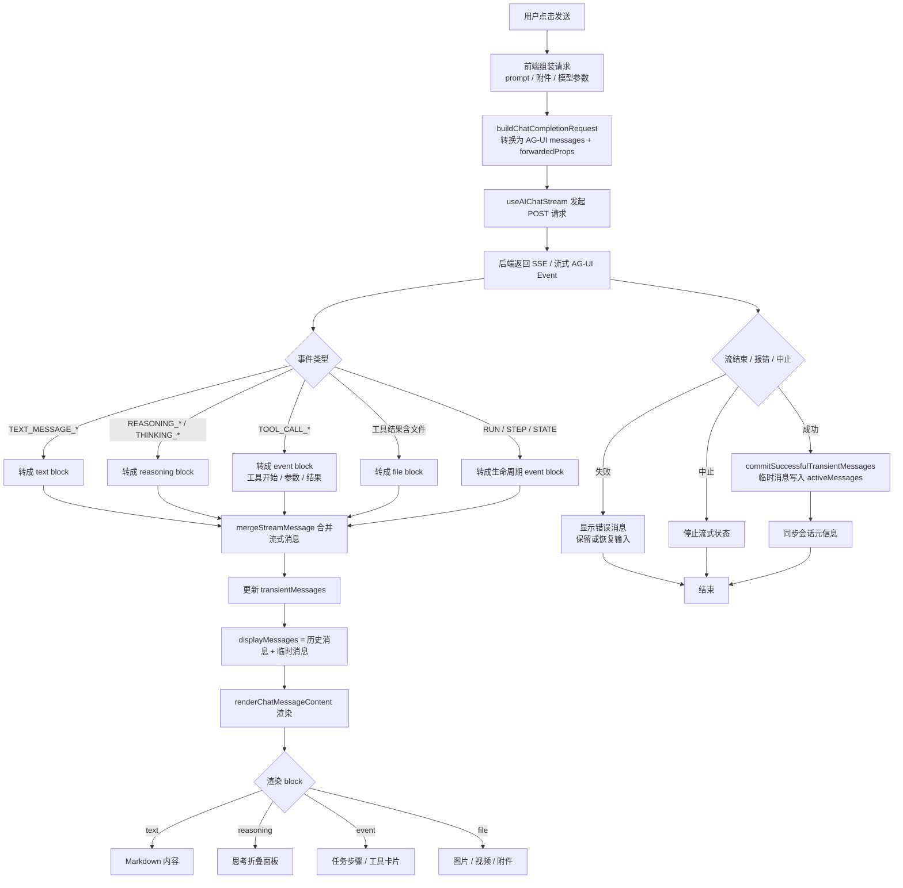

# AI Plugin

`ai` 插件为系统提供 AI 相关能力。

## 功能概览

- AI Chat：基于 AI Elements Vue 本地组件构建对话界面，支持流式对话、Markdown 展示、代码块、来源、附件与推理过程渲染
- Topic & History：管理会话话题、聊天历史与消息上下文
- Quick Phrase：管理快捷短语并在对话时快速复用
- Provider：管理 AI 供应商配置
- Model：管理供应商下可用模型
- MCP：管理可接入的 MCP 服务

## AI 对话请求流程

简版链路：用户发送 -> 前端转 AG-UI 请求 -> 后端流式返回 AG-UI events -> 前端转 blocks -> 合并临时 assistant 消息 -> 渲染 text/reasoning/event/file -> 成功后提交到 activeMessages -> 结束
